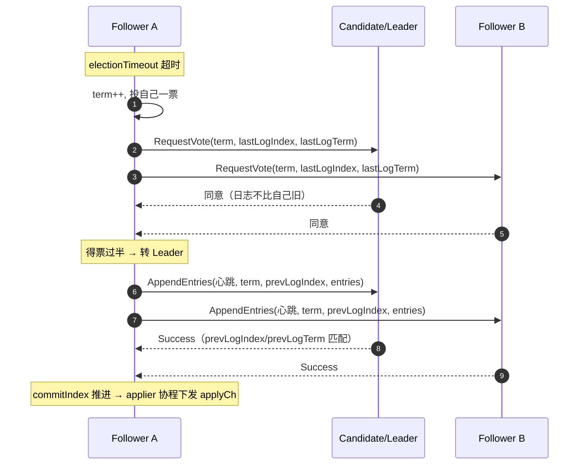
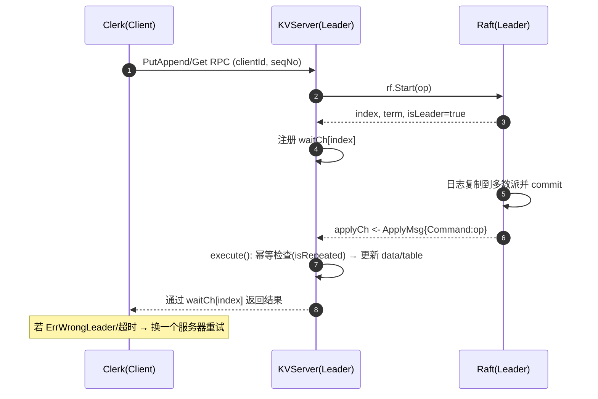
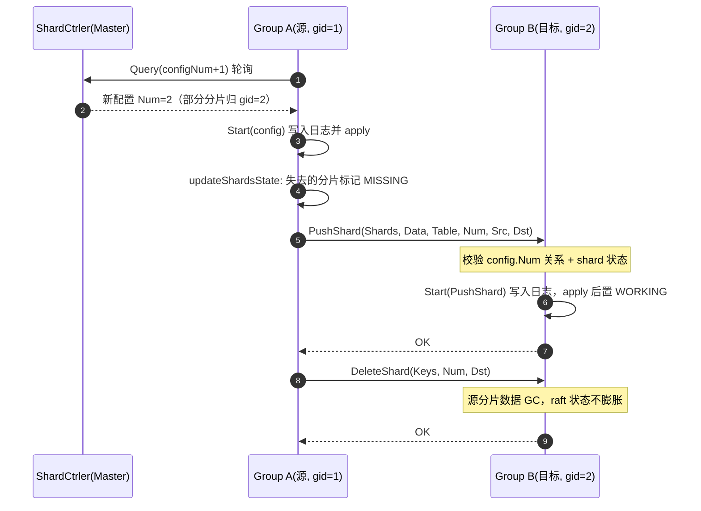

# my

## mac
go 1.17不行，换go版本
export GOROOT="/Users/ibqo/development/go"
export PATH="/Users/ibqo/development/go/bin:$PATH"

```
ibqodeMBP:mit-6.824_fravenx ibqo$  export PATH="/Users/ibqo/development/go/bin:$PATH"
ibqodeMBP:mit-6.824_fravenx ibqo$ go version
go version go1.24.6 darwin/amd64
ibqodeMBP:mit-6.824_fravenx ibqo$ go env
AR='ar'
CC='clang'
CGO_CFLAGS='-O2 -g'
CGO_CPPFLAGS=''
CGO_CXXFLAGS='-O2 -g'
CGO_ENABLED='1'
CGO_FFLAGS='-O2 -g'
CGO_LDFLAGS='-O2 -g'
CXX='clang++'
GCCGO='gccgo'
GO111MODULE='on'
GOAMD64='v1'
GOARCH='amd64'
GOAUTH='netrc'
GOBIN=''
GOCACHE='/Users/ibqo/Library/Caches/go-build'
GOCACHEPROG=''
GODEBUG=''
GOENV='/Users/ibqo/Library/Application Support/go/env'
GOEXE=''
GOEXPERIMENT=''
GOFIPS140='off'
GOFLAGS=''
GOGCCFLAGS='-fPIC -arch x86_64 -m64 -pthread -fno-caret-diagnostics -Qunused-arguments -fmessage-length=0 -ffile-prefix-map=/var/folders/vk/_xdm46qn66182z1cy9k7qvr80000gn/T/go-build3066368003=/tmp/go-build -gno-record-gcc-switches -fno-common'
GOHOSTARCH='amd64'
GOHOSTOS='darwin'
GOINSECURE=''
GOMOD='/dev/null'
GOMODCACHE='/Users/ibqo/go/pkg/mod'
GONOPROXY=''
GONOSUMDB=''
GOOS='darwin'
GOPATH='/Users/ibqo/go'
GOPRIVATE=''
GOPROXY='https://goproxy.cn,direct'
GOROOT='/usr/local/go'
GOSUMDB=''
GOTELEMETRY='local'
GOTELEMETRYDIR='/Users/ibqo/Library/Application Support/go/telemetry'
GOTMPDIR=''
GOTOOLCHAIN=''
GOTOOLDIR='/usr/local/go/pkg/tool/darwin_amd64'
GOVCS=''
GOVERSION='go1.24.6'
GOWORK=''
PKG_CONFIG='pkg-config'
ibqodeMBP:mit-6.824_fravenx ibqo$
```


## doc script
```
- go build -o ./bin/mrcoordinator ./main/mrcoordinator.go
- go build -o ./bin/mrworker ./main/mrworker.go
- go build -o ./bin/mrsequential ./main/mrsequential.go

- go build -o ./bin/wc ./mrapps/wc.go
- go build -o ./bin/indexer ./mrapps/indexer.go

- go run ./main/mrcoordinator.go
- go run ./mrapps/wc.go
```

```
ibqo@ibqodeMBP src % go test ./raft
ok      6.5840/raft     302.763s
```

运行并编译测试（这是课程默认用法）：
- raft：go test ./raft
- kvraft：go test ./kvraft
- shardctrler：go test ./shardctrler

python3 -m pip install --user typer rich

raft % 
VERBOSE=1 dtest -n 2000 -p 5 -s  2A 这是raft运行2000次命令行，我怎么运行？

raft % 这是raft目录下 
VERBOSE=1 dtest -n 1000 -p 100 -s  2B
VERBOSE=1 dtest -n 10000 -p 100 -s  2C

kvraft目录
VERBOSE=1 dtest -n 500 -p 20 -s 3A
VERBOSE=1 dtest -n 500 -p 20 -s 3B
shardctrler目录
VERBOSE=1 dtest -n 500 -p 50 -s 4A

ibqo@ibqodeMBP mit-6.824_fravenx % cd src/raft 
ibqo@ibqodeMBP raft % export VERBOSE=1; python3 ./dtest -n 2 -p 2 -s 2A

备用方案（不用 dtest）
- 直接用 go test 连续运行（无并发控制、日志汇总）：
  - VERBOSE=1 go test -run 2A -count=2000
- 开启竞态检测：
  - VERBOSE=1 go test -run 2A -count=2000 -race

https://github.com/wdidada126/6.5840-golabs-2023

Lab of MIT 6.824 2023 所有lab 稳定通过一万次以上 All labs stably passed 10,000 times


```shell
'go version'
go version go1.16.6 linux/amd64
```

低版本go不行

```shell
cd src/main
./test-mr.sh
```


```shell
ibqo@ibqodeMBP src % go test ./kvraft
ok      6.5840/kvraft   393.121s
```


```shell
ibqodeMBP:main ibqo$ ./test-mr.sh
go version go1.17.13 darwin/amd64
*** Turning off -race since it may not work on a Mac
with  go version go1.17.13 darwin/amd64
*** Cannot find timeout command; proceeding without timeouts.
# command-line-arguments
ld: warning: -no_pie is deprecated when targeting new OS versions
# command-line-arguments
ld: warning: -no_pie is deprecated when targeting new OS versions
*** Starting wc test.
2025/11/27 22:52:18 rpc.Register: method "Done" has 1 input parameters; needs exactly three
--- wc test: PASS
*** Starting indexer test.
2025/11/27 22:52:25 rpc.Register: method "Done" has 1 input parameters; needs exactly three
--- indexer test: PASS
*** Starting map parallelism test.
2025/11/27 22:52:28 rpc.Register: method "Done" has 1 input parameters; needs exactly three
--- map parallelism test: PASS
*** Starting reduce parallelism test.
2025/11/27 22:52:36 rpc.Register: method "Done" has 1 input parameters; needs exactly three
--- reduce parallelism test: PASS
*** Starting job count test.
2025/11/27 22:52:45 rpc.Register: method "Done" has 1 input parameters; needs exactly three
--- job count test: PASS
*** Starting early exit test.
2025/11/27 22:53:02 rpc.Register: method "Done" has 1 input parameters; needs exactly three
--- early exit test: PASS
*** Starting crash test.
2025/11/27 22:53:11 rpc.Register: method "Done" has 1 input parameters; needs exactly three
--- crash test: PASS
*** PASSED ALL TESTS
```


```shell
cd src/labrpc
go test -v
=== RUN   TestTypes
--- PASS: TestTypes (0.00s)
=== RUN   TestDisconnect
--- PASS: TestDisconnect (0.00s)
=== RUN   TestCounts
--- PASS: TestCounts (0.00s)
=== RUN   TestBytes
--- PASS: TestBytes (0.00s)
=== RUN   TestConcurrentMany
--- PASS: TestConcurrentMany (0.00s)
=== RUN   TestUnreliable
--- PASS: TestUnreliable (0.03s)
=== RUN   TestConcurrentOne
--- PASS: TestConcurrentOne (0.00s)
=== RUN   TestRegression1
--- PASS: TestRegression1 (0.10s)
=== RUN   TestKilled
--- PASS: TestKilled (1.10s)
=== RUN   TestBenchmark
1.26843181s for 100000
--- PASS: TestBenchmark (1.27s)
PASS
ok      6.5840/labrpc   2.511s
```


```shell
cd src/labgob
go test -v
```

```shell
cd src/shardctrler
wdidada@LAPTOP-wdidada:/mnt/d/develops/git/github/go/MIT-6.824_fravenx/src/shardctrler$ go test -v
=== RUN   TestBasic4A
Test: Basic leave/join ...
doJoin %v at S%d 0xc0002da9f0 1
doJoin %v at S%d 0xc0002daff0 2
doJoin %v at S%d 0xc000314f90 0
doJoin %v at S%d 0xc00038f5f0 1
doJoin %v at S%d 0xc000421140 0
doJoin %v at S%d 0xc00038fbf0 2
doLeave %v at S%d [1/1]0xc000444608 1
doLeave %v at S%d [1/1]0xc000444768 0
doLeave %v at S%d [1/1]0xc00020b648 2
doLeave %v at S%d [1/1]0xc00020a248 1
doLeave %v at S%d [1/1]0xc00020a3a8 2
doLeave %v at S%d [1/1]0xc00011a668 0
  ... Passed
Test: Historical queries ...
doJoin %v at S%d 0xc0001170e0 0
doJoin %v at S%d 0xc000117140 0
doLeave %v at S%d [1/1]0xc00020b0c8 0
doLeave %v at S%d [1/1]0xc00020b0d0 0
doJoin %v at S%d 0xc00033a5d0 1
doJoin %v at S%d 0xc00033a630 1
doLeave %v at S%d [1/1]0xc00020bd38 1
doLeave %v at S%d [1/1]0xc00020bd40 1
  ... Passed
Test: Move ...
doJoin %v at S%d 0xc000486e40 2
doJoin %v at S%d 0xc000487590 0
doJoin %v at S%d 0xc000486ea0 2
doLeave %v at S%d [1/1]0xc00011b108 2
doLeave %v at S%d [1/1]0xc00011b110 2
doJoin %v at S%d 0xc0003a97d0 0
doJoin %v at S%d 0xc000487b90 2
doJoin %v at S%d 0xc0003a9dd0 2
doJoin %v at S%d 0xc0003a8c90 1
doJoin %v at S%d 0xc000465470 1
doMove shard = %d,gid = %d at S%d
 0 503 0
doMove shard = %d,gid = %d at S%d
 0 503 1
doMove shard = %d,gid = %d at S%d
 0 503 2
doMove shard = %d,gid = %d at S%d
 1 503 0
doMove shard = %d,gid = %d at S%d
 1 503 2
doMove shard = %d,gid = %d at S%d
 1 503 1
doMove shard = %d,gid = %d at S%d
 2 503 0
doMove shard = %d,gid = %d at S%d
 2 503 1
doMove shard = %d,gid = %d at S%d
 2 503 2
doMove shard = %d,gid = %d at S%d
 3 503 0
doMove shard = %d,gid = %d at S%d
 3 503 2
doMove shard = %d,gid = %d at S%d
 3 503 1
doMove shard = %d,gid = %d at S%d
 4 503 2
doMove shard = %d,gid = %d at S%d
 4 503 0
doMove shard = %d,gid = %d at S%d
 4 503 1
doMove shard = %d,gid = %d at S%d
 5 504 0
doMove shard = %d,gid = %d at S%d
 5 504 1
doMove shard = %d,gid = %d at S%d
 5 504 2
doMove shard = %d,gid = %d at S%d
 6 504 0
doMove shard = %d,gid = %d at S%d
 6 504 2
doMove shard = %d,gid = %d at S%d
 6 504 1
doMove shard = %d,gid = %d at S%d
 7 504 0
doMove shard = %d,gid = %d at S%d
 7 504 2
doMove shard = %d,gid = %d at S%d
 7 504 1
doMove shard = %d,gid = %d at S%d
 8 504 0
doMove shard = %d,gid = %d at S%d
 8 504 2
doMove shard = %d,gid = %d at S%d
 8 504 1
doMove shard = %d,gid = %d at S%d
 9 504 0
doMove shard = %d,gid = %d at S%d
 9 504 2
doMove shard = %d,gid = %d at S%d
 9 504 1
doLeave %v at S%d [1/1]0xc000445178 0
doLeave %v at S%d [1/1]0xc0004452e8 2
doLeave %v at S%d [1/1]0xc00020b7e8 1
doLeave %v at S%d [1/1]0xc00020b978 0
  ... Passed
doLeave %v at S%d [1Test: Concurrent leave/join ...
/1]0xc00020bae8 2
doLeave %v at S%d [1/1]0xc0004455e8 1
doJoin %v at S%d 0xc000501830 2
doJoin %v at S%d 0xc0003a9b90 2
doJoin %v at S%d 0xc000162570 1
doJoin %v at S%d 0xc0001625a0 1
doJoin %v at S%d 0xc00043f050 2
doJoin %v at S%d 0xc0004653e0 2
doJoin %v at S%d 0xc000465410 2
doJoin %v at S%d 0xc000501170 0
doJoin %v at S%d 0xc0003a9530 0
doJoin %v at S%d 0xc0001625d0 1
doJoin %v at S%d 0xc000162600 1
doJoin %v at S%d 0xc000162630 1
doJoin %v at S%d 0xc000162660 1
doJoin %v at S%d 0xc0002e8810 1
doJoin %v at S%d 0xc0002e8840 1
doJoin %v at S%d 0xc00043e9c0 0
doJoin %v at S%d 0xc000421290 0
doJoin %v at S%d 0xc00036a1b0 2
doJoin %v at S%d 0xc00036aff0 2
doJoin %v at S%d 0xc0003aea50 2
doJoin %v at S%d 0xc0001f2900 2
doJoin %v at S%d 0xc000464db0 0
doJoin %v at S%d 0xc000421740 0
doJoin %v at S%d 0xc0001160c0 1
doJoin %v at S%d 0xc00036a960 0
doJoin %v at S%d 0xc000558d80 0
doJoin %v at S%d 0xc000487b30 0
doJoin %v at S%d 0xc000315a70 2
doJoin %v at S%d 0xc00038e090 2
doJoin %v at S%d 0xc00038f230 2
doJoin %v at S%d 0xc00038f260 2
doJoin %v at S%d 0xc00038f290 2
doJoin %v at S%d 0xc0001d53b0 2
doJoin %v at S%d 0xc0001d53e0 2
doJoin %v at S%d 0xc0001d4210 0
doJoin %v at S%d 0xc00033a120 1
doJoin %v at S%d 0xc00033a150 1
doJoin %v at S%d 0xc0003151a0 0
doJoin %v at S%d 0xc00033ac60 1
doJoin %v at S%d 0xc00033ac90 1
doJoin %v at S%d 0xc00038f7d0 1
doJoin %v at S%d 0xc00038fd10 1
doJoin %v at S%d 0xc00038fd40 1
doJoin %v at S%d 0xc0002dafc0 0
doJoin %v at S%d 0xc0000dbf20 0
doJoin %v at S%d 0xc0002da0c0 0
doJoin %v at S%d 0xc000255620 0
doJoin %v at S%d 0xc0001d4600 0
doLeave %v at S%d [1/1]0xc000444e28 0
doLeave %v at S%d [1/1]0xc000193668 1
doJoin %v at S%d 0xc000558540 0
doJoin %v at S%d 0xc000559ec0 1
doLeave %v at S%d [1/1]0xc000193680 1
doJoin %v at S%d 0xc000559ef0 1
doLeave %v at S%d [1/1]0xc000445018 2
doJoin %v at S%d 0xc000558c90 2
doLeave %v at S%d [1/1]0xc000445548 2
doJoin %v at S%d 0xc0000dbd10 2
doJoin %v at S%d 0xc0001f27b0 1
doJoin %v at S%d 0xc00036a8d0 2
doJoin %v at S%d 0xc0002e8660 2
doLeave %v at S%d [1/1]0xc000444340 2
doLeave %v at S%d [1/1]0xc00040c428 2
doLeave %v at S%d [1/1]0xc00040cc98 0
doJoin %v at S%d 0xc000464bd0 0
doJoin %v at S%d 0xc0003a9cb0 0
doJoin %v at S%d 0xc0003afe00 0
doLeave %v at S%d [1/1]0xc00040c9b8 2
doLeave %v at S%d [1/1]0xc00040c9c0 2
doLeave %v at S%d [1/1]0xc00040d028 0
doLeave %v at S%d [1/1]0xc00040c168 0
doJoin %v at S%d 0xc0001f3410 1
doLeave %v at S%d [1/1]0xc000010588 1
doLeave %v at S%d [1/1]0xc000444528 0
doLeave %v at S%d [1/1]0xc00040d258 0
doLeave %v at S%d [1/1]0xc000444c88 2
doLeave %v at S%d [1/1]0xc000010590 1
doLeave %v at S%d [1/1]0xc000192038 0
doLeave %v at S%d [1/1]0xc000192798 1
doLeave %v at S%d [1/1]0xc0004448b0 1
doLeave %v at S%d [1/1]0xc000011228 0
doLeave %v at S%d [1/1]0xc00040ce48 1
doLeave %v at S%d [1/1]0xc00040da28 1
doLeave %v at S%d [1/1]0xc00040d778 2
doLeave %v at S%d [1/1]0xc000444038 0
doLeave %v at S%d [1/1]0xc0001922c8 0
doLeave %v at S%d [1/1]0xc000444258 2
doLeave %v at S%d [1/1]0xc00040c2a0 2
doLeave %v at S%d [1/1]0xc0000104a8 1
doLeave %v at S%d [1/1]0xc00040c628 1
  ... Passed
Test: Minimal transfers after joins ...
doJoin %v at S%d 0xc0001f3e60 0
doJoin %v at S%d 0xc00033a5a0 2
doJoin %v at S%d 0xc0002db110 1
doJoin %v at S%d 0xc0002db980 0
doJoin %v at S%d 0xc00038e0f0 2
doJoin %v at S%d 0xc000420420 1
doJoin %v at S%d 0xc00038f500 0
doJoin %v at S%d 0xc000420d20 2
doJoin %v at S%d 0xc0001d5500 1
doJoin %v at S%d 0xc0001d5ce0 0
doJoin %v at S%d 0xc0001d45a0 1
doJoin %v at S%d 0xc00033a750 2
doJoin %v at S%d 0xc00038ea20 0
doJoin %v at S%d 0xc00038f080 2
doJoin %v at S%d 0xc00033b320 1
  ... Passed
Test: Minimal transfers after leaves ...
doLeave %v at S%d [1/1]0xc0004446e8 0
doLeave %v at S%d [1/1]0xc000192cf8 2
doLeave %v at S%d [1/1]0xc000444988 1
doLeave %v at S%d [1/1]0xc00040c778 0
doLeave %v at S%d [1/1]0xc00040c9d8 2
doLeave %v at S%d [1/1]0xc000444df8 1
doLeave %v at S%d [1/1]0xc000193138 0
doLeave %v at S%d [1/1]0xc000193388 2
doLeave %v at S%d [1/1]0xc00040ce28 1
doLeave %v at S%d [1/1]0xc0004451e8 0
doLeave %v at S%d [1/1]0xc000010fc8 1
doLeave %v at S%d [1/1]0xc000445488 2
doLeave %v at S%d [1/1]0xc0001939b8 0
doLeave %v at S%d [1/1]0xc000193bf8 2
doLeave %v at S%d [1/1]0xc00040d200 1
  ... Passed
--- PASS: TestBasic4A (1.64s)
=== RUN   TestMulti4A
Test: Multi-group join/leave ...
doJoin %v at S%d 0xc0005010e0 0
doJoin %v at S%d 0xc00036b740 1
doJoin %v at S%d 0xc000465740 2
doJoin %v at S%d 0xc0003c09f0 0
doJoin %v at S%d 0xc0003c0ff0 2
doJoin %v at S%d 0xc000314a50 1
doLeave %v at S%d [2/2]0xc00020a690 0
doLeave %v at S%d [2/2]0xc00020a800 2
doLeave %v at S%d [2/2]0xc00020aaf0 1
doLeave %v at S%d [1/1]0xc000011458 0
doLeave %v at S%d   ... Passed
[1Test: Concurrent multi leave/join ...
/1]0xc0000115c8 2
doLeave %v at S%d [1/1]0xc000193118 1
doJoin %v at S%d 0xc000500a80 2
doJoin %v at S%d 0xc0003ae150 2
doJoin %v at S%d 0xc000330060 2
doJoin %v at S%d 0xc000331020 1
doJoin %v at S%d 0xc000331080 1
doJoin %v at S%d 0xc0003310e0 1
doJoin %v at S%d 0xc000500450 0
doJoin %v at S%d 0xc0000ff980 0
doJoin %v at S%d 0xc000465710 0
doJoin %v at S%d 0xc0003af7d0 0
doJoin %v at S%d 0xc0001f36b0 0
doJoin %v at S%d 0xc000117b60 0
doJoin %v at S%d 0xc000331bf0 0
doJoin %v at S%d 0xc000331140 1
doJoin %v at S%d 0xc0003311a0 1
doJoin %v at S%d 0xc0003308a0 1
doJoin %v at S%d 0xc000330900 1
doJoin %v at S%d 0xc000178780 2
doJoin %v at S%d 0xc0001f3d40 2
doJoin %v at S%d 0xc000540a50 2
doJoin %v at S%d 0xc0003afad0 0
doLeave %v at S%d [2/2]0xc0004444a0 0
doJoin %v at S%d 0xc0003141b0 2
doJoin %v at S%d 0xc000254570 1
doLeave %v at S%d [2/2]0xc000444e40 1
doJoin %v at S%d 0xc0002545d0 1
doLeave %v at S%d [2/2]0xc0004455b0 1
doLeave %v at S%d [2/2]0xc0004455c0 1
doLeave %v at S%d [2/2]0xc0004455d0 1
doJoin %v at S%d 0xc000421830 1
doJoin %v at S%d 0xc0000dbd40 0
doLeave %v at S%d [2/2]0xc000192b20 0
doLeave %v at S%d [2/2]0xc000594dd0 0
doJoin %v at S%d 0xc0001796e0 2
doLeave %v at S%d [2/2]0xc000444ac0 2
doJoin %v at S%d 0xc0002e8270 2
doLeave %v at S%d [2/2]0xc000193a60 1
doLeave %v at S%d [2/2]0xc00040c0f0 1
doLeave %v at S%d [2/2]0xc000192e40 2
doLeave %v at S%d [2/2]0xc000445280 0
doJoin %v at S%d 0xc000178120 0
doLeave %v at S%d [2/2]0xc0005950c0 2
doLeave %v at S%d [2/2]0xc00011bc00 0
doLeave %v at S%d [2/2]0xc000445910 2
doLeave %v at S%d [2/2]0xc000595a20 0
doJoin %v at S%d 0xc0001d5140 2
doLeave %v at S%d [2/2]0xc00011be60 2
doLeave %v at S%d [2/2]0xc000595c90 2
doLeave %v at S%d [2/2]0xc000010780 0
doLeave %v at S%d [2/2]0xc00040c040 0
doLeave %v at S%d [2/2]0xc00020ab90 1
doLeave %v at S%d [2/2]0xc00020aba0 1
doLeave %v at S%d [2/2]0xc00020abc0 1
doLeave %v at S%d [2/2]0xc00040c220 0
doLeave %v at S%d [2/2]0xc0000105e0 2
doLeave %v at S%d [2/2]0xc0000105f0 2
doLeave %v at S%d [2/2]0xc000011320 1
doLeave %v at S%d [2/2]0xc000010ca0 2
doLeave %v at S%d [2/2]0xc00060c500 0
doLeave %v at S%d [2/2]0xc00020b130 2
  ... Passed
Test: Minimal transfers after multijoins ...
doJoin %v at S%d 0xc0001d5cb0 0
doJoin %v at S%d 0xc0004205d0 2
doJoin %v at S%d 0xc0005581e0 1
  ... Passed
Test: Minimal transfers after multileaves ...
doLeave %v at S%d [5/5]0xc0005d4240 0
doLeave %v at S%d [5/5]0xc000457e00 2
doLeave %v at S%d [5/5]0xc0005d4600 1
  ... Passed
Test: Check Same config on servers ...
  ... Passed
--- PASS: TestMulti4A (1.29s)
PASS
ok      6.5840/shardctrler      2.929s
```

```
cd src/shardkv
go test -v
```

```
wdidada@LAPTOP-wdidada:/mnt/d/develops/git/github/go/MIT-6.824_fravenx/src/shardctrler$ cd src/shardkv
go test -v

bash: cd: src/shardkv:

=== RUN   TestBasic4A
Test: Basic leave/join ...
doJoin %v at S%d 0xc00030f290 1
doJoin %v at S%d 0xc00030f890 2
doJoin %v at S%d 0xc0001eb4d0 0
doJoin %v at S%d 0xc000329950 1
doJoin %v at S%d 0xc000329f50 2
doJoin %v at S%d 0xc00039d560 0
doLeave %v at S%d [1/1]0xc000011588 1
doLeave %v at S%d [1/1]0xc000376018 2
doLeave %v at S%d [1/1]0xc0000116e8 0
doLeave %v at S%d [1/1]0xc000285898 1
doLeave %v at S%d [1/1]0xc0000101c8 0
doLeave %v at S%d [1/1]0xc000376138 2
  ... Passed
Test: Historical queries ...
doJoin %v at S%d 0xc00023fd40 0
doJoin %v at S%d 0xc00023fda0 0
doLeave %v at S%d [1/1]0xc0002847b8 0
doLeave %v at S%d [1/1]0xc0002847c0 0
doJoin %v at S%d 0xc00009a7e0 1
doJoin %v at S%d 0xc00009a840 1
doLeave %v at S%d [1/1]0xc000285198 1
doLeave %v at S%d [1/1]0xc0002851a0 1
  ... Passed
Test: Move ...
doJoin %v at S%d 0xc0003431d0 0
doJoin %v at S%d 0xc0003429c0 2
doJoin %v at S%d 0xc000342a20 2
doLeave %v at S%d [1/1]0xc000377378 2
doLeave %v at S%d [1/1]0xc000377380 2
doJoin %v at S%d 0xc0001eb860 2
doJoin %v at S%d 0xc0003437d0 1
doJoin %v at S%d 0xc0004a4330 0
doJoin %v at S%d 0xc0004a4ba0 2
doJoin %v at S%d 0xc00039ca50 1
doMove shard = %d,gid = %d at S%d
 0 503 0
doMove shard = %d,gid = %d at S%d
 0 503 2
doMove shard = %d,gid = %d at S%d
 0 503 1
doMove shard = %d,gid = %d at S%d
 1 503 0
doMove shard = %d,gid = %d at S%d
 1 503 2
doMove shard = %d,gid = %d at S%d
 1 503 1
doMove shard = %d,gid = %d at S%d
 2 503 0
doMove shard = %d,gid = %d at S%d
 2 503 2
doMove shard = %d,gid = %d at S%d
 2 503 1
doMove shard = %d,gid = %d at S%d
 3 503 0
doMove shard = %d,gid = %d at S%d
 3 503 2
doMove shard = %d,gid = %d at S%d
 3 503 1
doMove shard = %d,gid = %d at S%d
 4 503 0
doMove shard = %d,gid = %d at S%d
 4 503 2
doMove shard = %d,gid = %d at S%d
 4 503 1
doMove shard = %d,gid = %d at S%d
 5 504 0
doMove shard = %d,gid = %d at S%d
 5 504 1
doMove shard = %d,gid = %d at S%d
 5 504 2
doMove shard = %d,gid = %d at S%d
 6 504 0
doMove shard = %d,gid = %d at S%d
 6 504 2
doMove shard = %d,gid = %d at S%d
 6 504 1
doMove shard = %d,gid = %d at S%d
 7 504 0
doMove shard = %d,gid = %d at S%d
 7 504 2
doMove shard = %d,gid = %d at S%d
 7 504 1
doMove shard = %d,gid = %d at S%d
 8 504 0
doMove shard = %d,gid = %d at S%d
 8 504 2
doMove shard = %d,gid = %d at S%d
 8 504 1
doMove shard = %d,gid = %d at S%d
 9 504 0
doMove shard = %d,gid = %d at S%d
 9 504 2
doMove shard = %d,gid = %d at S%d
 9 504 1
doLeave %v at S%d [1/1]0xc000119658 0
doLeave %v at S%d [1/1]0xc0001197c8 2
doLeave %v at S%d [1/1]0xc00027cdd8 1
doLeave %v at S%d [1/1]0xc00043d518 0
  ... Passed
Test: Concurrent leave/join ...
doLeave %v at S%d [1/1]0xc00043d688 1
doLeave %v at S%d [1/1]0xc000011428 2
doJoin %v at S%d 0xc0002f2450 1
doJoin %v at S%d 0xc0002f2480 1
doJoin %v at S%d 0xc0002f24b0 1
doJoin %v at S%d 0xc0002f24e0 1
doJoin %v at S%d 0xc0002f2510 1
doJoin %v at S%d 0xc0002f2540 1
doJoin %v at S%d 0xc0000cbc80 0
doJoin %v at S%d 0xc000343ad0 0
doJoin %v at S%d 0xc0002f2570 1
doJoin %v at S%d 0xc00048a330 2
doJoin %v at S%d 0xc0003b61b0 2
doJoin %v at S%d 0xc00043e7e0 0
doJoin %v at S%d 0xc0003294d0 0
doJoin %v at S%d 0xc00043f170 1
doJoin %v at S%d 0xc0004a4ab0 2
doJoin %v at S%d 0xc00043fbf0 1
doJoin %v at S%d 0xc0004a4ae0 2
doJoin %v at S%d 0xc0003b79b0 2
doJoin %v at S%d 0xc00048ab70 2
doJoin %v at S%d 0xc00043e690 2
doJoin %v at S%d 0xc0000fd290 2
doJoin %v at S%d 0xc00027f530 1
doJoin %v at S%d 0xc0003b7080 0
doJoin %v at S%d 0xc0004a4540 0
doJoin %v at S%d 0xc00027f560 1
doJoin %v at S%d 0xc0002f3740 2
doJoin %v at S%d 0xc0004a8d20 2
doJoin %v at S%d 0xc000329860 0
doJoin %v at S%d 0xc0003436b0 0
doJoin %v at S%d 0xc00027efc0 2
doJoin %v at S%d 0xc0001d4270 2
doJoin %v at S%d 0xc00048ba40 0
doJoin %v at S%d 0xc00009b830 1
doJoin %v at S%d 0xc0000fc960 0
doJoin %v at S%d 0xc00027e900 0
doJoin %v at S%d 0xc00009ac90 0
doJoin %v at S%d 0xc00030ed50 1
doJoin %v at S%d 0xc00030ed80 1
doJoin %v at S%d 0xc00030edb0 1
doJoin %v at S%d 0xc00030ede0 1
doJoin %v at S%d 0xc00030ee10 1
doLeave %v at S%d [1/1]0xc000010818 1
doLeave %v at S%d [1/1]0xc000376b50 1
doJoin %v at S%d 0xc00026e5d0 0
doJoin %v at S%d 0xc0003d2ae0 2
doJoin %v at S%d 0xc0003d2c90 2
doJoin %v at S%d 0xc0000caae0 2
doJoin %v at S%d 0xc0000cab10 2
doJoin %v at S%d 0xc0001eb5f0 2
doLeave %v at S%d [1/1]0xc00027c6f8 2
doJoin %v at S%d 0xc00043eae0 1
doJoin %v at S%d 0xc0002f2b10 1
doLeave %v at S%d [1/1]0xc0001187f0 2
doJoin %v at S%d 0xc00030e1b0 0
doJoin %v at S%d 0xc00048b620 2
doJoin %v at S%d 0xc0004a59b0 2
doJoin %v at S%d 0xc0001ea210 0
doJoin %v at S%d 0xc0001d57d0 0
doJoin %v at S%d 0xc00023f830 0
doLeave %v at S%d [1/1]0xc000010508 0
doJoin %v at S%d 0xc000383260 2
doJoin %v at S%d 0xc000382900 1
doLeave %v at S%d [1/1]0xc0001185d8 0
doJoin %v at S%d 0xc0001eaf00 0
doLeave %v at S%d [1/1]0xc000010498 2
doJoin %v at S%d 0xc0003d3dd0 0
doLeave %v at S%d [1/1]0xc000376768 2
doJoin %v at S%d 0xc0002f3a40 0
doLeave %v at S%d [1/1]0xc000377578 0
doLeave %v at S%d [1/1]0xc00027c800 2
doLeave %v at S%d [1/1]0xc000118ef0 2
doLeave %v at S%d [1/1]0xc000118ef8 2
doLeave %v at S%d [1/1]0xc000376558 0
doLeave %v at S%d [1/1]0xc0001186b8 0
doLeave %v at S%d [1/1]0xc000377418 2
doLeave %v at S%d [1/1]0xc000376078 0
doLeave %v at S%d [1/1]0xc000376158 0
doLeave %v at S%d [1/1]0xc0003771d8 0
doLeave %v at S%d [1/1]0xc000376298 1
doLeave %v at S%d [1/1]0xc000118c48 1
doLeave %v at S%d [1/1]0xc000118c50 1
doLeave %v at S%d [1/1]0xc000118c58 1
doLeave %v at S%d [1/1]0xc000376ec0 1
doLeave %v at S%d [1/1]0xc000011278 1
doLeave %v at S%d [1/1]0xc000011458 0
doLeave %v at S%d [1/1]0xc000119d68 2
doLeave %v at S%d [1/1]0xc0003779b8 0
doLeave %v at S%d [1/1]0xc000010200 2
doLeave %v at S%d [1/1]0xc0001182f8 1
doLeave %v at S%d [1/1]0xc000118300 1
  ... Passed
Test: Minimal transfers after joins ...
doJoin %v at S%d 0xc00027e840 0
doJoin %v at S%d 0xc00027ef00 2
doJoin %v at S%d 0xc0003d2150 1
doJoin %v at S%d 0xc000382f90 0
doJoin %v at S%d 0xc0003835c0 2
doJoin %v at S%d 0xc0003d3440 1
doJoin %v at S%d 0xc000129260 0
doJoin %v at S%d 0xc00030e750 2
doJoin %v at S%d 0xc00027fd10 1
doJoin %v at S%d 0xc0000caa80 0
doJoin %v at S%d 0xc00030fb00 2
doJoin %v at S%d 0xc0000cb0e0 1
doJoin %v at S%d 0xc00016fbf0 0
doJoin %v at S%d 0xc0001eb5c0 1
doJoin %v at S%d 0xc00048a180 2
  ... Passed
Test: Minimal transfers after leaves ...
doLeave %v at S%d [1/1]0xc00027c848 0
doLeave %v at S%d [1/1]0xc00027ca88 2
doLeave %v at S%d [1/1]0xc00043c348 1
doLeave %v at S%d [1/1]0xc000010528 0
doLeave %v at S%d [1/1]0xc00043c7d8 1
doLeave %v at S%d [1/1]0xc000376858 2
doLeave %v at S%d [1/1]0xc0000107c8 0
doLeave %v at S%d [1/1]0xc00043ca98 1
doLeave %v at S%d [1/1]0xc000010a20 2
doLeave %v at S%d [1/1]0xc000010cb8 0
doLeave %v at S%d [1/1]0xc000376be8 1
doLeave %v at S%d [1/1]0xc000010f20 2
doLeave %v at S%d [1/1]0xc00043d038 0
doLeave %v at S%d [1/1]0xc00043d280 2
doLeave %v at S%d [1/1]0xc000011258 1
  ... Passed
--- PASS: TestBasic4A (1.50s)
=== RUN   TestMulti4A
Test: Multi-group join/leave ...
doJoin %v at S%d 0xc00043e1b0 1
doJoin %v at S%d 0xc00043e8d0 2
doJoin %v at S%d 0xc00032e870 0
doJoin %v at S%d 0xc00026f1d0 1
doJoin %v at S%d 0xc000328600 0
doJoin %v at S%d 0xc00026f7d0 2
doLeave %v at S%d [2/2]0xc000376230 1
doLeave %v at S%d [2/2]0xc0003763b0 2
doLeave %v at S%d [2/2]0xc00043c5e0 0
doLeave %v at S%d [1/1]0xc00027cd38 1
doLeave %v at S%d [1/1]0xc00027ceb8 2
  ... Passed
Test: Concurrent multi leave/join ...
doLeave %v at S%d [1/1]0xc000376dd8 0
doJoin %v at S%d 0xc00030f0e0 1
doJoin %v at S%d 0xc00030f800 2
doJoin %v at S%d 0xc00032e330 2
doJoin %v at S%d 0xc00032fbc0 2
doJoin %v at S%d 0xc00032fc20 2
doJoin %v at S%d 0xc0000fc780 2
doJoin %v at S%d 0xc00032ef30 0
doLeave %v at S%d [2/2]0xc0001183f0 2
doJoin %v at S%d 0xc0000ca360 1
doJoin %v at S%d 0xc00043e330 1
doJoin %v at S%d 0xc00023e7e0 1
doJoin %v at S%d 0xc00048b770 1
doLeave %v at S%d [2/2]0xc00043ddc0 1
doJoin %v at S%d 0xc00039cc90 1
doJoin %v at S%d 0xc00032eff0 0
doJoin %v at S%d 0xc000492240 1
doJoin %v at S%d 0xc000328bd0 2
doJoin %v at S%d 0xc00032f050 0
doJoin %v at S%d 0xc00023f590 0
doJoin %v at S%d 0xc0004380f0 0
doLeave %v at S%d [2/2]0xc000118910 0
doJoin %v at S%d 0xc000438150 0
doJoin %v at S%d 0xc0002e4f00 2
doLeave %v at S%d [2/2]0xc000118280 1
doJoin %v at S%d 0xc000439200 1
doLeave %v at S%d [2/2]0xc0003c89b0 1
doJoin %v at S%d 0xc0002e4360 1
doLeave %v at S%d [2/2]0xc0001191e0 2
doLeave %v at S%d [2/2]0xc000118f30 1
doJoin %v at S%d 0xc0004381b0 0
doJoin %v at S%d 0xc0004a4900 2
doLeave %v at S%d [2/2]0xc000284d90 0
doLeave %v at S%d [2/2]0xc000119210 2
doJoin %v at S%d 0xc0001a5740 0
doJoin %v at S%d 0xc0004a4a20 2
doLeave %v at S%d [2/2]0xc000284dc0 0
doJoin %v at S%d 0xc0001a57a0 0
doLeave %v at S%d [2/2]0xc0003c9730 0
doLeave %v at S%d [2/2]0xc000285e30 0
doLeave %v at S%d [2/2]0xc000119250 2
doJoin %v at S%d 0xc00039c300 0
doLeave %v at S%d [2/2]0xc000285600 2
doLeave %v at S%d [2/2]0xc0002853b0 1
doJoin %v at S%d 0xc0003d36e0 2
doJoin %v at S%d 0xc0001ea7e0 1
doLeave %v at S%d [2/2]0xc00043c2d0 2
doLeave %v at S%d [2/2]0xc00043c040 1
doLeave %v at S%d [2/2]0xc0000101f0 0
doLeave %v at S%d [2/2]0xc000010370 1
doLeave %v at S%d [2/2]0xc000376890 1
doLeave %v at S%d [2/2]0xc00027c340 1
doLeave %v at S%d [2/2]0xc00027c750 0
doLeave %v at S%d [2/2]0xc00027c760 0
doLeave %v at S%d [2/2]0xc000010680 2
doLeave %v at S%d [2/2]0xc00027c5d0 2
doLeave %v at S%d [2/2]0xc00027c5e0 2
doLeave %v at S%d [2/2]0xc00027c770 0
doLeave %v at S%d [2/2]0xc0000114f0 1
doLeave %v at S%d [2/2]0xc000377a90 0
doLeave %v at S%d [2/2]0xc000011770 2
  ... Passed
Test: Minimal transfers after multijoins ...
doJoin %v at S%d 0xc00030f200 1
doJoin %v at S%d 0xc00030f9b0 2
doJoin %v at S%d 0xc0004a9260 0
  ... Passed
Test: Minimal transfers after multileaves ...
doLeave %v at S%d [5/5]0xc000178c90 1
doLeave %v at S%d [5/5]0xc00021b650 2
doLeave %v at S%d [5/5]0xc000282900 0
  ... Passed
Test: Check Same config on servers ...
  ... Passed
--- PASS: TestMulti4A (1.42s)
PASS
ok      6.5840/shardctrler      2.922s
```

```
cd src/kvraft
3A 3B
wdidada@LAPTOP-wdidada:/mnt/d/develops/git/github/go/MIT-6.824_fravenx/src/kvraft$ go test -v
--- PASS: TestSnapshotRecoverManyClients3B (21.18s)
=== RUN   TestSnapshotUnreliable3B
Test: unreliable net, snapshots, many clients (3B) ...
  ... Passed --  16.9  5 12072 1183
--- PASS: TestSnapshotUnreliable3B (16.91s)
=== RUN   TestSnapshotUnreliableRecover3B
Test: unreliable net, restarts, snapshots, many clients (3B) ...
  ... Passed --  20.8  5 12697 1202
--- PASS: TestSnapshotUnreliableRecover3B (20.83s)
=== RUN   TestSnapshotUnreliableRecoverConcurrentPartition3B
Test: unreliable net, restarts, partitions, snapshots, many clients (3B) ...
  ... Passed --  28.1  5  9762  822
--- PASS: TestSnapshotUnreliableRecoverConcurrentPartition3B (28.12s)
=== RUN   TestSnapshotUnreliableRecoverConcurrentPartitionLinearizable3B
Test: unreliable net, restarts, partitions, snapshots, random keys, many clients (3B) ...
  ... Passed --  31.9  7 28562 1904
--- PASS: TestSnapshotUnreliableRecoverConcurrentPartitionLinearizable3B (31.89s)
PASS
ok      6.5840/kvraft   391.454s
```

---

# 测试报告（2026-08-23，Go 1.24.2 linux/amd64）

环境：Ubuntu 24.04 (WSL2)；Go 安装于 ~/.local/go（go1.24.2）；go.mod 为 go 1.15，Go 1.24 下编译通过。
测试命令：`cd src && go test ./raft ./kvraft ./shardctrler ./shardkv`；Lab1 用 `cd src/main && ./test-mr.sh`。

## 测试结果（全部 PASS）

| Lab | 测试 | 结果 | 耗时 |
|---|---|---|---|
| Lab1 | test-mr.sh（wc/indexer/map并行/reduce并行/jobcount/early exit/crash） | PASS 7/7 | ~8min |
| Lab2 | raft 2A 选举 | PASS | 16.6s |
| Lab2 | raft 2B 日志复制 | PASS | 35.8s |
| Lab2 | raft 2C 持久化 | PASS | 118.6s |
| Lab2 | raft 2D 快照 | PASS | 139.1s |
| Lab3 | kvraft 3A | PASS | 246.9s |
| Lab3 | kvraft 3B | PASS | 142.2s |
| Lab4a | shardctrler 4A | PASS | 3.0s |
| Lab4b | shardkv 基本功能x4 | PASS | 17.7s |
| Lab4b | shardkv 并发x3 | PASS | 32.9s |
| Lab4b | shardkv 不可靠x3 | PASS | 19.4s |
| Lab4b | shardkv Challengex3 | PASS | 25.8s |

说明：
- raft 全量（2A~2D）一起跑 5 分钟跑不完（2C+2D 单测约 4.3 分钟），拆开逐个跑全部通过；CI 工作流中已给足超时。
- go vet 仅有课程自带测试代码的惯用写法警告，非错误。
- CI 已配置：.github/workflows/test.yml（push/PR 触发，Go 1.24.x，分 5 步跑 lab1~lab4b）。

---

# 各 Lab 知识点与源码位置

## Lab1 MapReduce（mr）

知识点：
1. MapReduce 模型：Map 按 key 哈希分 nReduce 个中间桶，Reduce 按 key 聚合；中间文件先写临时文件再原子重命名，避免读到半成品。
2. Coordinator 调度：任务三态（idle/in-progress/completed），worker 通过 RPC 拉取任务（pull 模式）；超时未完成任务被重置，实现 crash 容错。
3. worker 主循环：循环拉任务 -> 执行 -> 汇报结果。

源码位置：
- src/mr/coordinator.go：MakeCoordinator L168（初始化）、GetTask L44（任务分发）、ReportTask L91（任务汇报）、resetExpired L125（超时重置）、allMapsDone L139 / allReducesDone L148、Done L159
- src/mr/worker.go：Worker L39（主循环）、runMap L94（map 任务）、runReduce L160（reduce 任务）、ihash L32（key 分桶）
- src/mr/rpc.go：RPC 消息与 Task 结构定义

## Lab2 Raft（raft）

知识点：
1. 领导选举：term + 随机超时（150-300ms）+ 过半投票 + 先到先得；票数过半转 leader。
2. 日志复制：AppendEntries 做 prevLogIndex/prevLogTerm 一致性检查；leader 用 nextIndex/matchIndex 推进；firstIndex 快速回退优化。
3. 安全性：只 commit 当前 term 的日志；投票时比较日志新旧（term 大者/日志长者为新）。
4. 持久化（2C）：currentTerm/votedFor/log 三个字段 persist。
5. 快照（2D）：Snapshot 截断 log；落后 follower 通过 InstallSnapshot 直接发快照。
6. apply 单例：单独 applier 协程按序发 applyCh（sync.Cond 通知），保证不重不漏、无并发乱序。

源码位置（src/raft/raft.go）：
- 选举：ticker L590（超时触发选举）、RequestVote L245（投票处理）
- 日志复制：AppendEntries L272、handleAppendEntriesReply L761（回退推进）、updateCommitIndex L554（commit 推进）
- 持久化：persist L113 / readPersist L126
- 快照：Snapshot L158、InstallSnapshot L346、installSnapshot L804
- 其他：Start L430（提交入口）、applier L842、sendHeartbeat L680 / sendHeartbeatTo L724、Make L897

## Lab3 KVRaft（kvraft）

知识点：
1. 线性一致性：所有读写都进 raft 日志串行执行，从 applyCh 取出后执行并回给等待的 RPC。
2. 幂等去重：clientId + seqNo 去重表，写操作重放不重复执行（isRepeated）。
3. leader 切换：client 遇 ErrWrongLeader / RPC 失败换 leader 重试。
4. 快照：raft 状态超过 maxraftstate 阈值时持久化 server 状态（data + 去重表），重启读快照恢复。

源码位置：
- src/kvraft/server.go：Get L39、PutAppend L92（写日志）、isRepeated L165（幂等去重）、execute L173（apply 后执行）、getSnapshot L251 / readSnapshot L260、StartKVServer L290
- src/kvraft/client.go：Get L43、PutAppend L75（带 clientId+seqNo 重试）

## Lab4a ShardCtrler（shardctrler）

知识点：
1. 配置版本：configs 数组按 Num 递增保存每届配置快照，Query 支持历史版本查询。
2. Rebalance：维护 gid->shard 集合，取分片最多/最少的组，相差 >1 时成批搬移，使各组分片尽量均衡（minimal transfer）。
3. 状态机复制：Join/Leave/Move/Query 全部走 raft 日志执行。

源码位置：
- src/shardctrler/server.go：Join L38、Leave L73、Move L109、Query L144、doJoin L218（join+rebalance）、doLeave L251（leave+rebalance）、doMove L292、isRepeated L304
- src/shardctrler/executer.go：execute L5（apply 循环）、applyMsg L15、reply L57

## Lab4b ShardKV（shardkv）

知识点：
1. 分片状态机：Working/Missing/Adding，非 Working 的分片拒绝读写请求（checkShard）。
2. 配置逐版应用：全部 shard 就绪才拉取下一版配置（readyForNewConfig），避免跨版本直接迁移导致数据不一致。
3. 分片迁移：PushShardRPC 携带 data + 去重表 + 源/目标 gid + 配置 Num，重复接收不破坏数据。
4. 垃圾回收：DeleteShardRPC 通知源集群删除已迁走的 shard（GC），否则分片残留会导致 2B 测试失败。
5. 快照持久化：config + lastConfig + shard 状态 + data + 去重表。

源码位置（src/shardkv/server.go）：
- checkShard L57（shard 状态检查）、Get L68 / PutAppend L127、PushShard L181（接收迁移）、DeleteShard L241（GC）
- updateConfig L323（轮询拉配置）、updateShardsState L344（状态标记）、readyForNewConfig L314
- preparePushShardArgs L368（构造迁移数据）、sendPushShardRPC L401 / sendDeleteShardRPC L413 / sendShards L433
- getSnapshot L450 / readSnapshot L463
- src/shardkv/client.go：key2shard L20（key->shard 映射）、Get L64 / PutAppend L98（先查配置定位 group）

---

# 项目 README（博客结构版）

> MIT 6.824/6.5840 分布式系统课程全 4 个 Lab 完整实现（MapReduce / Raft / KVRaft / ShardKV，含 4B Challenges），已通过全部测试并接入 GitHub Actions CI。

## 一、项目概览

| Lab | 模块 | 目录 | 核心内容 |
|---|---|---|---|
| Lab1 | MapReduce | src/mr | Coordinator 任务调度 + Worker 执行，容 crash |
| Lab2 | Raft 共识 | src/raft | 选举、日志复制、持久化、快照 |
| Lab3 | KVRaft | src/kvraft | 线性一致 KV，幂等去重，快照恢复 |
| Lab4a | ShardCtrler | src/shardctrler | 分片配置管理 + 自动 Rebalance |
| Lab4b | ShardKV | src/shardkv | 多组集群分片迁移 + GC + Challenges |

## 二、各 Lab 核心设计（要点）

- **Lab1 MapReduce**：Map 输出按 key 哈希分 nReduce 个中间文件；Coordinator 维护任务三态（idle/in-progress/completed），worker 通过 RPC 拉取任务（pull 模式）；任务超时（10s）自动重置以容 worker crash；中间文件先写临时文件再原子重命名。
- **Lab2 Raft**：随机超时（150-300ms）触发选举，term 单调递增，得票过半转 leader；AppendEntries 做 prevLogIndex/prevLogTerm 一致性检查，冲突段用 FirstIndex 快速回退；只 commit 当前 term 的日志；currentTerm/votedFor/log 持久化；快照压缩日志（2D）。
- **Lab3 KVRaft**：所有读写都进 raft 日志串行执行，从 applyCh 取命令后应用并回给等待的 RPC；clientId+seqNo 去重表保证幂等；raft 状态超阈值时持久化 server 快照（data + 去重表）。
- **Lab4a ShardCtrler**：configs 按 Num 递增保存配置快照；Join/Leave/Move/Query 全走 raft 日志；Rebalance 策略：max-min 分片差 >1 时每次搬一半，保证各组负载均衡且 minimal transfer。
- **Lab4b ShardKV**：每 shard 三态（Working/Missing/Adding），非 Working 拒绝请求；配置逐版应用（全部就绪才拉下一版）；PushShardRPC 迁移数据+去重表，DeleteShardRPC 通知源组 GC。

## 三、架构与核心时序

### 3.1 Raft 选举与日志复制



### 3.2 KVRaft：Client 请求 → Apply 回调完整流程



### 3.3 ShardKV：配置更新 + 分片迁移握手（Push + GC）



## 四、测试结果与性能数据

环境：Ubuntu 24.04 (WSL2) / Go 1.24.2 / 单机。命令：`cd src && go test ./raft ./kvraft ./shardctrler ./shardkv`。

### 4.1 单轮耗时（全部 PASS）

| 测试 | 耗时 | 测试 | 耗时 |
|---|---|---|---|
| raft 2A | 16.6s | kvraft 3A | 246.9s |
| raft 2B | 35.8s | kvraft 3B | 142.2s |
| raft 2C | 118.6s | shardctrler 4A | 3.0s |
| raft 2D | 139.1s | shardkv 4B 全量 | ~96s |
| lab1 test-mr.sh | ~8min | shardkv Challenge | ~26s |

### 4.2 稳定性（防 flaky 验证，连续 3 次）

| 测试 | 3 连跑总耗时 | 通过率 |
|---|---|---|
| raft 2C | 358.9s | 3/3 PASS |
| raft 2D | 411.7s | 3/3 PASS |
| shardkv Challenge（3 项） | 83.8s | 3/3 PASS |

结论：2C/2D 持久化与快照路径稳定，无 flaky；Challenge 在 -count=3 下全部通过。

### 4.3 4B Challenge 测试场景说明

- **TestChallenge1Delete（分片删除/GC）**：`make_config(t, 3, false, 1)` —— maxraftstate=1 强制每条日志后做快照。写 30 个 key（各 1KB）后反复 `join(1)→leave(0)→join(2)→leave(1)→join(0)→leave(2)` 两轮。校验各 group 的 RaftStateSize：若迁走的分片数据未 GC，raft 状态会持续膨胀超过限制 → 失败。**核心验证点：DeleteShard 必须真正删除数据。**
- **TestChallenge2Unaffected（未受影响分片访问）**：网络不可靠 + 快照。JOIN 100 → 写数据 → JOIN 101（部分 shard 迁到 101）→ **KILL 100** → LEAVE 100。此时 101 永远无法从 100 迁到数据，但校验 101 自有 shard 仍可正常读写。**核心验证点：部分迁移失败不得影响已拥有分片。**
- **TestChallenge2Partial（部分迁移）**：三组同时 JOIN 后写数据，在迁移未全部完成时校验未受影响分片可访问。**核心验证点：分片状态机（Working/Adding）正确处理未完成迁移。**

## 五、踩坑记录（重点）

### 5.1 Lab2 Raft

1. **firstIndex（快照截断）与 log 物理下标的关系**：`compactTo`（raft.go L499）截断后 `log[0]` 变为哨兵项 `Entry{Index: lastIncludedIndex, Term: lastIncludedTerm}`，后续 `rf.log[0].Index` 不再是 1。**所有按逻辑 index 取日志的操作都必须走 `getByIndex`（L523，二分查找返回物理下标）**，直接 `rf.log[index - firstIndex]` 在快照后必然越界或取错。典型错误出现在 `handleAppendEntriesReply` L774：回退前必须用 `rf.getByIndex(rf.nextIndex[i]-1)` 校验 leader 自身日志，防止用过期回复覆盖 nextIndex。
2. **AppendEntries 的 prevLogIndex 命中快照截断点**（L291）：follower 侧用 `getByIndex(args.PrevLogIndex)` 判断：
   - `PrevLogIndex == log[0].Index`（恰好是哨兵项）→ exists=true，只需校验 Term 匹配（哨兵项 Term 即 lastIncludedTerm）；
   - `PrevLogIndex < log[0].Index`（follower 落后于快照点）→ exists=false，回复 `Success=false, FirstIndex=-1`，leader 侧用 term 扫描快速回退（L779-784）；
   - 若直接写 `rf.log[PrevLogIndex - log[0].Index]`，负数下标会 panic，且语义错误。
3. **append 日志的覆盖语义**（L314-325）：逐条比较 `cmpCommand(log[i+k], args.Entries[i-1])`，不匹配则截断 `rf.log[:i+k]` 再追加，否则跳过（已存在）；`i+k < len(rf.log)` 判断要基于物理下标。
4. **apply 必须单协程 + 条件变量**：`applier`（L842）持有锁循环，`commitIndex > lastApplied` 时组装 ApplyMsg 批量发送，发前释放锁（防 channel 阻塞卡死整个 Raft）；commit 推进后用 `applyCond.Signal()`（L335）唤醒。若在 RPC 处理协程里直接发 applyCh，一旦上层消费慢会阻塞心跳/选举。
5. **commit 推进的安全性**：`updateCommitIndex`（L554）从 `commitIndex+1` 起找**当前 term** 的日志过半才推进（防上一 term 的日志被"间接提交"后又因新 leader 覆盖导致回滚）；`getByIndex` 不存在（已截断）则停止。

### 5.2 Lab3 KVRaft

1. **去重表在快照恢复后正确重建**：快照只 encode `table`（clientId→最大 seqNo）+ `data`（kvraft/server.go `getSnapshot` L251）。`readSnapshot`（L260）解码后整体替换两个 map，**顺序不能反**（先 table 后 data，与 encode 顺序一致）。坑：若快照里 table 落后于最近已应用的 op，重启后该 op 会被重放 —— 设计上依赖"快照总是在状态变更完成后、`bytes` 超阈值时立刻生成"（execute L227-235），且幂等表保证重放无害。
2. **重复写操作也要处理快照**（L198-211）：`isRepeated` 命中的 op 虽然不执行，但**仍可能触发快照**（否则 `bytes` 一直涨），且必须 `continue` 跳过后续，不能把 `kv.data` 再写一遍。
3. **Get 也更新 table**（L183-185）：Get 无副作用但同样记录 seqNo，用于后续重试幂等；注意 Get 返回时若 `kv.table[clientId] == op.SeqNo` 才回值（L187），防止读到旧值。
4. **waitCh 通知必须 non-blocking**：`select { case kv.waitCh[clientId] <- op: default: }`（L190、L221），因为 RPC handler 可能已因 50ms 超时返回，通道满会卡死 apply 循环。

### 5.3 Lab4b ShardKV（含 Challenge）

1. **PushShard 幂等性——防止"重复迁移把新数据覆盖成旧数据"**（server.go L181-239），按 `config.Num` 与 `args.Num` 三路判断：
   - `config.Num < args.Num`（目标组还没到该配置）：**直接返回 OK 并丢弃，不写入日志**（L187-191）。否则日志里出现"未来配置的迁移"，apply 时会基于旧 config 覆盖数据；目标组靠后续 updateConfig 追赶 + 源组重发来完成真正迁移。
   - `config.Num > args.Num`（旧配置的迟到迁移）：直接 OK + 触发 DeleteShard 帮源组 GC（L193-198）。
   - `config.Num == args.Num` 且 shard 已 WORKING（重复迁移）：直接 OK + DeleteShard（L199-211），**绝不重写 data** —— 这是防覆盖的关键；只有处于 MISSING 才 `rf.Start(*args)` 写日志真正执行。
2. **DeleteShard 只带 Keys 而非整个 Data**（L416-421）：GC 时按 key 删除，防止误删迁移后目标组的新写入（challenge1 直接检查 raft 状态大小，若 GC 不彻底会膨胀超限）。
3. **updateConfig 轮询节奏**（L323-342）：只有 `readyForNewConfig()`（无 MISSING 分片）且是 leader 时才 Query(Num+1)；非 leader/未就绪则 sleep 跳过。若配置跳版（一次 Query 拿到最新版），旧迁移一律按"Num 不匹配"丢弃，不会污染。
4. **shard 状态机初始化**（L344-357）：`lastConfig.Num == 0`（首个配置）直接 return，避免把"上版归属别人"误标为 ADDING；状态迁移只在 `lastConfig.Num != 0` 后按 lastConfig→config 逐 shard 比较。
5. **迁移参数必须携带 Num/Src/Dst/Table**：`preparePushShardArgs`（L368）打包 data + `copyTable(kv.table)`（去重表随迁，否则目标组重启后会重放源组已执行的写） + Src/Dst server 地址 + Num。src/dst 从 `lastConfig.Groups` / `config.Groups` 取（L393/395），不能写死。

### 5.4 Lab1 MapReduce（简）

- 中间文件命名 `mr-X-Y`（X map 任务号，Y reduce 桶号），reduce 端必须按 key 排序后聚合；`ihash` 决定桶归属，map 端和 worker 端哈希函数必须一致。
- Coordinator 对"卡死任务"用 10s 超时重置（`resetExpired` coordinator.go L125），但**不能重置已完成任务**，否则重复分配导致重复输出；ReportTask 里按任务类型分别更新计数。
- `Done` 判定要等所有 reduce 完成（`allReducesDone` L148），且全部状态访问加锁。

### 5.5 其他小坑

- `shardctrler/server.go` L219/L253/L293 存在调试残留 `println("doJoin %v at S%d", ...)`——Go 内置 `println` 不支持格式化串，会原样打印字符串且无法取值，测试输出会乱；应改用 `fmt.Printf` 或删除（建议删除，不影响正确性）。
- `test-mr.sh` 原为 CRLF 行尾导致 Linux 下 shebang 失效，已通过 `.gitattributes`（`*.sh text eol=lf`）+ CI 中 sed 双保险修复。
- `go.mod` 声明 go 1.15，Go 1.24 下直接编译通过，无需改动。

1. 补充“踩坑记录”
每个 Lab 都有一些经典难题，您可以补充实际编码中遇到的坑和解决思路，这对读者更有参考价值。例如：

Lab2：firstIndex 与快照配合时 log 切片索引的边界计算（容易 out of range）

Lab2：AppendEntries 中 prevLogIndex 命中了快照截断点时的处理

Lab3：重复请求（duplicate request）去重表在快照恢复后如何正确重建

Lab4b：跨配置版本迁移时，如何避免“重复迁移导致数据被旧数据覆盖”（即 PushShard 的幂等性细节）

2. 增加架构图或时序图

Raft 选举/日志复制的核心时序

KVRaft 从 Client 发起请求到 Apply 回调的完整流程

ShardKV 配置更新 + 分片迁移的握手过程（Push + GC）

3. 整理性能数据
您已有耗时数据，可以补充：

Raft 2C/2D 持久化和快照的测试通过次数（是否稳定无 flaky）

4B Challenge 测试的具体场景（如网络分区 + 并发迁移同时发生）

4. 格式化为博客/项目 README
如果您打算把这份文档发布为技术博客或 GitHub 项目说明，我可以帮您：

重新组织成“项目概览 → 各 Lab 核心设计 → 测试结果 → 实现细节 → 遇到的坑”结构

---

# 如何运行 2A 测试并通过日志理解 Raft

这个项目不需要先启动服务。2A 测试会自动在进程内创建多个 Raft 节点、模拟网络断连并检查选举结果。

## 运行 2A 测试

进入 Go module 所在目录：

```bash
cd /Users/ibqo/Develop/git/github/golang/mit-6.824_fravenx/src
```

运行全部 2A：

```bash
go test ./raft -run '2A$' -count=1 -v
```

分别运行三个用例：

```bash
go test ./raft -run '^TestInitialElection2A$' -count=1 -v
go test ./raft -run '^TestReElection2A$' -count=1 -v
go test ./raft -run '^TestManyElections2A$' -count=1 -v
```

三个用例分别观察：

- `InitialElection`：3 个节点首次选出 Leader。
- `ReElection`：Leader 断网、重新选举、丢失多数派、恢复多数派。
- `ManyElections`：7 个节点反复随机断开和恢复。
- `-count=1`：禁止 Go 使用测试缓存，确保每次真的重新运行。

首个用例已经实际验证，当前代码可以通过。

## 打开 Raft 日志

日志由 `VERBOSE` 环境变量控制，定义在 `src/raft/util.go`。

```bash
VERBOSE=1 go test ./raft -run '^TestInitialElection2A$' -count=1 -v
```

保存并实时查看：

```bash
VERBOSE=1 go test ./raft -run '2A$' -count=1 -v 2>&1 \
  | tee /tmp/raft-2a.log
```

事后筛选关键事件：

```bash
rg 'VOTE|LEAD|TERM|TIMR|PASS|FAIL' /tmp/raft-2a.log
```

典型输出：

```text
005380 VOTE S1 become leader
```

含义是：

- `005380`：程序启动后约 538 ms，单位是 0.1 ms。
- `VOTE`：投票/选举主题。
- `S1`：编号为 1 的 Raft 节点。
- `become leader`：该节点获得多数票，成为 Leader。

测试末尾例如：

```text
... Passed --  3.5  3  62  16040  0
```

依次表示：耗时、节点数、RPC 数、RPC 字节数、达成一致的日志条数。2A 只测试选举，所以最后通常是 `0`。

## 当前日志为什么比较少

当前选举路径中的很多日志被注释了，例如：

- 收到、拒绝和同意投票：`src/raft/raft.go` 的 `RequestVote` 方法。
- 选举超时及发起选举：`src/raft/raft.go` 的 `ticker` 方法。
- 发送 `RequestVote`：`ticker` 中调用 `sendRequestVote` 的位置。
- 成为 Leader：统计到多数票之后设置 `rf.state = LEADER` 的位置。

为了学习，建议临时取消这些 `Debug(dVote, ...)` 行前面的注释。然后运行：

```bash
VERBOSE=1 go test ./raft -run '^TestReElection2A$' -count=1 -v
```

可以观察到下面的因果链：

```text
选举超时
→ currentTerm 增加
→ Follower 变成 Candidate
→ 给自己投票
→ 向其他节点发送 RequestVote
→ Follower 接受或拒绝
→ 获得多数票
→ Candidate 变成 Leader
→ Leader 发送心跳
→ 旧 Leader 重连后看到更大 Term，退回 Follower
```

不要一开始打开每一次心跳日志，因为心跳间隔只有 100 ms，会很吵。先关注 `Term`、`Candidate`、`Vote`、`Leader` 四类变化最容易理解。

## 并发与稳定性检查

用 race detector 检查锁和共享状态：

```bash
VERBOSE=1 go test -race ./raft -run '2A$' -count=1 -v
```

仓库还提供了批量压力测试器 `src/raft/dtest`：

```bash
cd raft
./dtest '2A$' -n 100 -p 4
```

保存所有轮次日志：

```bash
./dtest '2A$' -n 20 -p 4 -v -a -o /tmp/raft-2a-runs
```

学习时推荐先按 `InitialElection → ReElection → ManyElections` 的顺序单独运行，理解正确后再使用 `dtest` 压测。

## 2A日志解析

缩写	含义
TIMR	选举计时器超时（election timeout）
VOTE	投票相关事件
TERM	任期变更
LEAD	成为 leader
DROP	网络消息被故意丢弃（模拟网络分区/丢包）
节点编号：S0、S1、S2...（7个节点时到 S6）


Raft 论文中的术语	你的日志缩写
election timeout	TIMR
RequestVote RPC	VOTE
term	TERM
leader	LEAD
网络分区/丢包	DROP
论文只定义算法逻辑，不关心你怎么打印日志。
